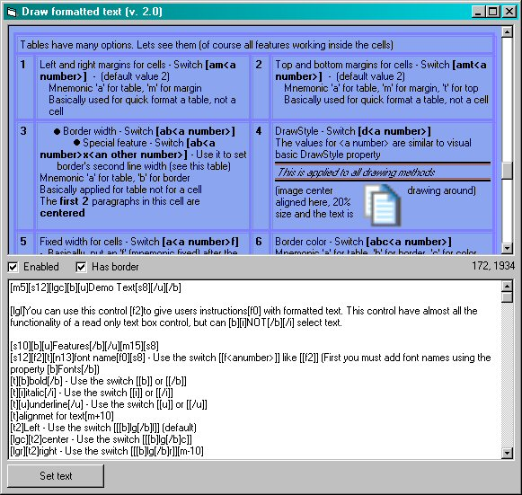



## Draw formated text, tables, pictures

### Description

Draw formatted text (with any alignment), draw tables (double border), draw pictures (any alignment and inside cells)

You can use this control to give users instructions with formatted text. This control have almost all the functionality of a read only text box control, but can NOT select text.

Features:

alignment,

font name,

bold,

italic,

underline,

font size,

lines,

Bullets,

Colors,

Web links

Also, left margin for paragraphs. Line spacing and space before/after a paragrath.

Note: Also, you can set the margin for the second (and other) lines as well.

Draw images by path, by handle, by resource number with any alignment. Also text around images.

Draw tables and use all features inside cells.
 
### More Info
 

             |
---                |---
**Submitted On**   |2003-05-08 07:57:04
**By**             |[UserXP](https://github.com/Planet-Source-Code/PSCIndex/blob/master/ByAuthor/userxp.md)
**Level**          |Intermediate
**User Rating**    |4.9 (49 globes from 10 users)
**Compatibility**  |VB 6\.0
**Category**       |[Custom Controls/ Forms/  Menus](https://github.com/Planet-Source-Code/PSCIndex/blob/master/ByCategory/custom-controls-forms-menus__1-4.md)
**World**          |[Visual Basic](https://github.com/Planet-Source-Code/PSCIndex/blob/master/ByWorld/visual-basic.md)
**Archive File**   |[Draw\_forma1646799182003\.zip](https://github.com/Planet-Source-Code/userxp-draw-formated-text-tables-pictures__1-48594/archive/master.zip)

